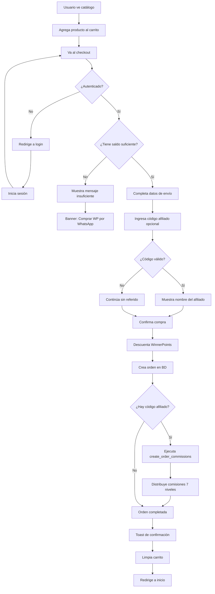
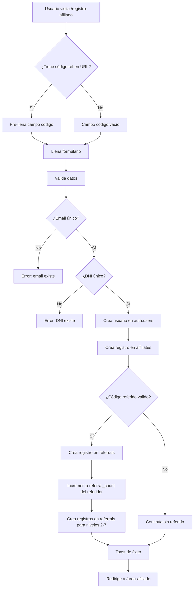
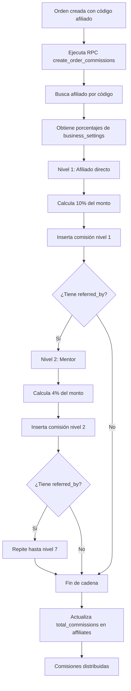
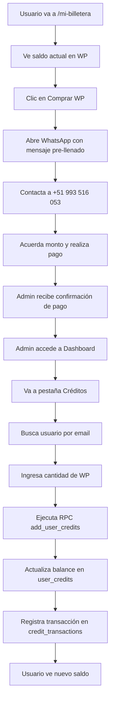

# 📋 INFORME TÉCNICO COMPLETO DEL SISTEMA
## Winner Organa - Plataforma E-commerce con Programa de Afiliados

---

## 📑 ÍNDICE

1. [Resumen Ejecutivo](#1-resumen-ejecutivo)
2. [Arquitectura del Sistema](#2-arquitectura-del-sistema)
3. [Stack Tecnológico](#3-stack-tecnológico)
4. [Modelo de Datos](#4-modelo-de-datos)
5. [Módulos del Sistema](#5-módulos-del-sistema)
6. [Funcionalidades Estructuradas y Complejas](#6-funcionalidades-estructuradas-y-complejas)
7. [Requisitos Funcionales](#7-requisitos-funcionales)
8. [Requisitos No Funcionales](#8-requisitos-no-funcionales)
9. [Flujos de Negocio](#9-flujos-de-negocio)
10. [Seguridad y Control de Acceso](#10-seguridad-y-control-de-acceso)
11. [Integraciones](#11-integraciones)
12. [Diagrama de Arquitectura](#12-diagrama-de-arquitectura)

---

## 1. RESUMEN EJECUTIVO

### 1.1 Descripción General
Winner Organa es una **plataforma de comercio electrónico B2C** especializada en productos orgánicos y naturales, con un sistema de **afiliados multinivel de 7 niveles** integrado. La plataforma permite a los usuarios comprar productos utilizando un sistema de puntos propietario llamado **WinnerPoints (WP)**.

### 1.2 Objetivos del Sistema
- Facilitar la venta de productos orgánicos de manera digital
- Gestionar un programa de afiliados con comisiones multinivel
- Proporcionar un panel administrativo completo para la gestión del negocio
- Ofrecer una experiencia de usuario fluida y responsive

### 1.3 Usuarios del Sistema
| Tipo de Usuario | Descripción | Permisos |
|-----------------|-------------|----------|
| **Visitante** | Usuario no registrado | Ver catálogo, información pública |
| **Usuario Registrado** | Cliente con cuenta | Comprar con WP, ver billetera |
| **Afiliado** | Usuario con código de afiliado | Ganar comisiones, ver red de referidos |
| **Administrador** | Gestor del sistema | CRUD completo, gestión de créditos, reportes |

---

## 2. ARQUITECTURA DEL SISTEMA

### 2.1 Patrón Arquitectónico
El sistema implementa una arquitectura **JAMstack (JavaScript, APIs, Markup)** moderna:

```
┌─────────────────────────────────────────────────────────────┐
│                    CAPA DE PRESENTACIÓN                      │
│  React 18 + TypeScript + Tailwind CSS + shadcn/ui           │
├─────────────────────────────────────────────────────────────┤
│                    CAPA DE ESTADO                            │
│  Zustand (Cart) + TanStack Query (Server State)             │
├─────────────────────────────────────────────────────────────┤
│                    CAPA DE SERVICIOS                         │
│  Supabase Client SDK + Edge Functions                        │
├─────────────────────────────────────────────────────────────┤
│                    CAPA DE DATOS                             │
│  PostgreSQL + Row Level Security (RLS)                       │
├─────────────────────────────────────────────────────────────┤
│                    CAPA DE AUTENTICACIÓN                     │
│  Supabase Auth (JWT + Sessions)                              │
└─────────────────────────────────────────────────────────────┘
```

### 2.2 Estructura de Directorios
```
src/
├── assets/              # Imágenes y recursos estáticos
├── components/          # Componentes React reutilizables
│   ├── admin/           # Componentes del panel administrativo
│   ├── legal/           # Componentes de documentos legales
│   └── ui/              # Componentes base (shadcn/ui)
├── hooks/               # Custom hooks de React
├── integrations/        # Configuración de Supabase
├── lib/                 # Utilidades
└── pages/               # Páginas/rutas de la aplicación
```

---

## 3. STACK TECNOLÓGICO

### 3.1 Frontend
| Tecnología | Versión | Propósito |
|------------|---------|-----------|
| **React** | 18.3.1 | Framework UI principal |
| **TypeScript** | - | Tipado estático |
| **Vite** | - | Build tool y dev server |
| **Tailwind CSS** | - | Framework CSS utility-first |
| **shadcn/ui** | - | Componentes UI accesibles |
| **Framer Motion** | 12.23.26 | Animaciones |
| **React Router** | 6.30.1 | Enrutamiento SPA |
| **Zustand** | 5.0.8 | Estado global (carrito) |
| **TanStack Query** | 5.83.0 | Gestión de estado del servidor |
| **Recharts** | 2.15.4 | Gráficos y visualizaciones |
| **Lucide React** | 0.462.0 | Iconografía |

### 3.2 Backend (BaaS)
| Tecnología | Propósito |
|------------|-----------|
| **Supabase** | Backend-as-a-Service |
| **PostgreSQL** | Base de datos relacional |
| **Supabase Auth** | Autenticación y autorización |
| **Edge Functions** | Lógica de servidor (Deno) |
| **Row Level Security** | Seguridad a nivel de fila |

### 3.3 Servicios Externos
| Servicio | Propósito | Estado |
|----------|-----------|--------|
| **Resend** | Envío de emails transaccionales | Pendiente de configurar |
| **WhatsApp Business** | Comunicación y soporte | Activo (manual) |

---

## 4. MODELO DE DATOS

### 4.1 Diagrama Entidad-Relación

```
┌─────────────────┐     ┌─────────────────┐     ┌─────────────────┐
│    products     │     │     orders      │     │   affiliates    │
├─────────────────┤     ├─────────────────┤     ├─────────────────┤
│ id (PK)         │◄────│ product_id (FK) │     │ id (PK)         │
│ name            │     │ id (PK)         │     │ user_id (FK)    │
│ description     │     │ order_number    │     │ affiliate_code  │
│ price           │     │ customer_name   │     │ name            │
│ stock           │     │ customer_email  │     │ email           │
│ image_url       │     │ amount          │     │ dni             │
│ rating          │     │ status          │     │ level           │
│ created_at      │     │ created_at      │     │ total_sales     │
│ updated_at      │     └─────────────────┘     │ referred_by(FK) │
└─────────────────┘              │              │ yape_number     │
                                 │              └─────────────────┘
                                 ▼                      │
                    ┌─────────────────┐                 │
                    │   commissions   │◄────────────────┘
                    ├─────────────────┤
                    │ id (PK)         │
                    │ affiliate_id(FK)│
                    │ order_id (FK)   │
                    │ amount          │
                    │ level (1-7)     │
                    │ status          │
                    └─────────────────┘

┌─────────────────┐     ┌─────────────────────┐
│  user_credits   │     │ credit_transactions │
├─────────────────┤     ├─────────────────────┤
│ id (PK)         │◄────│ user_credit_id (FK) │
│ user_id         │     │ id (PK)             │
│ email           │     │ amount              │
│ balance         │     │ type                │
│ created_at      │     │ description         │
│ updated_at      │     │ order_id (FK)       │
└─────────────────┘     │ admin_id            │
                        │ created_at          │
                        └─────────────────────┘

┌─────────────────┐     ┌─────────────────────┐
│   referrals     │     │    user_roles       │
├─────────────────┤     ├─────────────────────┤
│ id (PK)         │     │ id (PK)             │
│ referrer_id(FK) │     │ user_id             │
│ referred_id(FK) │     │ role (enum)         │
│ level (1-7)     │     │ created_at          │
│ created_at      │     └─────────────────────┘
└─────────────────┘

┌─────────────────────┐     ┌─────────────────────┐
│  business_settings  │     │  contact_messages   │
├─────────────────────┤     ├─────────────────────┤
│ id (PK)             │     │ id (PK)             │
│ business_name       │     │ nombre              │
│ commission_level_1-7│     │ email               │
│ whatsapp_number     │     │ whatsapp            │
│ contact_email       │     │ mensaje             │
│ notify_new_orders   │     │ status              │
│ notify_new_affiliates│    │ created_at          │
└─────────────────────┘     └─────────────────────┘
```

### 4.2 Descripción de Tablas Principales

#### 4.2.1 `products` - Catálogo de Productos
| Campo | Tipo | Descripción |
|-------|------|-------------|
| id | UUID | Identificador único |
| name | TEXT | Nombre del producto |
| description | TEXT | Descripción (Markdown) |
| price | NUMERIC | Precio en Soles (S/) |
| stock | INTEGER | Cantidad disponible |
| image_url | TEXT | URL de imagen |
| rating | INTEGER | Calificación (1-5) |

#### 4.2.2 `orders` - Pedidos
| Campo | Tipo | Descripción |
|-------|------|-------------|
| id | UUID | Identificador único |
| order_number | TEXT | Número de orden (ORD-timestamp) |
| customer_name | TEXT | Nombre del cliente |
| customer_email | TEXT | Email del cliente |
| customer_dni | TEXT | DNI (8 dígitos) |
| customer_phone | TEXT | Teléfono de contacto |
| shipping_address | TEXT | Dirección de envío |
| shipping_city | TEXT | Ciudad/Distrito |
| product_name | TEXT | Nombre del producto |
| product_id | UUID | FK a products |
| amount | NUMERIC | Monto total |
| status | TEXT | Estado del pedido |

#### 4.2.3 `affiliates` - Afiliados
| Campo | Tipo | Descripción |
|-------|------|-------------|
| id | UUID | Identificador único |
| user_id | UUID | FK a auth.users |
| affiliate_code | TEXT | Código único (WINABC123) |
| name | TEXT | Nombre completo |
| email | TEXT | Email |
| dni | TEXT | DNI (8 dígitos) |
| level | TEXT | Nivel del afiliado |
| total_sales | NUMERIC | Ventas acumuladas |
| total_commissions | NUMERIC | Comisiones acumuladas |
| referral_count | INTEGER | Cantidad de referidos |
| referred_by | UUID | FK a affiliates (quien lo refirió) |
| yape_number | TEXT | Número Yape para pagos |
| status | TEXT | Estado (Activo/Inactivo) |

#### 4.2.4 `user_credits` - Billetera de WinnerPoints
| Campo | Tipo | Descripción |
|-------|------|-------------|
| id | UUID | Identificador único |
| user_id | UUID | FK a auth.users |
| email | TEXT | Email del usuario |
| balance | NUMERIC | Saldo en WinnerPoints |

---

## 5. MÓDULOS DEL SISTEMA

### 5.1 Módulo de Tienda (E-commerce)

#### Páginas
| Ruta | Componente | Descripción |
|------|------------|-------------|
| `/` | `Index.tsx` | Página principal (Hero, Productos destacados) |
| `/catalogo` | `Catalogo.tsx` | Catálogo de productos con filtros |
| `/checkout` | `Checkout.tsx` | Proceso de pago con WinnerPoints |

#### Componentes Clave
- `ProductsSection.tsx`: Muestra productos populares basados en ventas
- `CartDrawer.tsx`: Drawer del carrito de compras
- `Header.tsx`: Navegación con carrito y cuenta de usuario

#### Hook de Estado
```typescript
// useCart.tsx - Zustand Store con persistencia
interface CartStore {
  items: CartItem[];
  addItem: (item) => void;
  removeItem: (id) => void;
  updateQuantity: (id, quantity) => void;
  clearCart: () => void;
  getTotalItems: () => number;
  getTotalPrice: () => number;
}
```

### 5.2 Módulo de Afiliados

#### Páginas
| Ruta | Componente | Descripción |
|------|------------|-------------|
| `/programa-afiliados` | `ProgramaAfiliados.tsx` | Landing del programa |
| `/registro-afiliado` | `RegistroAfiliado.tsx` | Formulario de registro |
| `/login-afiliado` | `LoginAfiliado.tsx` | Inicio de sesión |
| `/area-afiliado` | `AreaAfiliado.tsx` | Dashboard del afiliado |

#### Funcionalidades
- Registro con código de referido opcional
- Dashboard con estadísticas de comisiones
- Visualización de red de referidos (7 niveles)
- Compartir enlace en WhatsApp, Facebook, Twitter
- Actualización de perfil y número Yape

### 5.3 Módulo de Billetera (WinnerPoints)

#### Páginas
| Ruta | Componente | Descripción |
|------|------------|-------------|
| `/mi-billetera` | `MiBilletera.tsx` | Saldo y transacciones |

#### Hook de Créditos
```typescript
// useUserCredits.tsx
interface UserCredits {
  id: string;
  balance: number;
  email: string;
}

// Funciones de conversión
convertToSoles: (wp) => wp / 10     // 10 WP = S/ 1.00
convertToWinnerPoints: (soles) => soles * 10
```

### 5.4 Módulo Administrativo

#### Páginas
| Ruta | Componente | Descripción |
|------|------------|-------------|
| `/admin-login` | `AdminLogin.tsx` | Login de administrador |
| `/admin-dashboard` | `AdminDashboard.tsx` | Panel principal |

#### Pestañas del Dashboard
1. **Resumen**: Estadísticas generales
2. **Reportes**: Gráficos de ventas, productos, afiliados
3. **Créditos**: Gestión de WinnerPoints de usuarios
4. **Pedidos**: Lista y gestión de órdenes
5. **Afiliados**: CRUD de afiliados
6. **Productos**: CRUD de productos

#### Componentes Admin
- `CreditsManagement.tsx`: Agregar créditos a usuarios
- `ProductDialog.tsx`: Crear/editar productos
- `AffiliateDialog.tsx`: Crear/editar afiliados
- `OrderStatusDialog.tsx`: Cambiar estado de pedidos
- `ReportsSection.tsx`: Gráficos y exportación CSV
- `SettingsDialog.tsx`: Configuración del negocio

### 5.5 Módulo de Contacto

#### Páginas
| Ruta | Componente | Descripción |
|------|------------|-------------|
| `/contacto` | `Contacto.tsx` | Formulario de contacto |

#### Flujo
1. Usuario llena formulario (nombre, email, WhatsApp, mensaje)
2. Se guarda en tabla `contact_messages`
3. Estado inicial: "pending"
4. Admin puede ver y gestionar mensajes

---

## 6. FUNCIONALIDADES ESTRUCTURADAS Y COMPLEJAS

### 6.1 Sistema de Comisiones Multinivel (7 Niveles)

**Complejidad: ALTA** ⭐⭐⭐⭐⭐

#### Descripción
El sistema distribuye comisiones automáticamente hasta 7 niveles de profundidad cuando se realiza una venta.

#### Estructura de Comisiones
| Nivel | Porcentaje | Descripción |
|-------|------------|-------------|
| 1 | 10% | Referido directo |
| 2 | 4% | Segundo nivel |
| 3 | 2% | Tercer nivel |
| 4 | 2% | Cuarto nivel |
| 5 | 1% | Quinto nivel |
| 6 | 1% | Sexto nivel |
| 7 | 1% | Séptimo nivel |
| **Total** | **21%** | |

#### Implementación Técnica
```sql
-- Función RPC: create_order_commissions
CREATE OR REPLACE FUNCTION create_order_commissions(
  p_order_id UUID,
  p_order_amount NUMERIC,
  p_affiliate_code TEXT
)
```

**Flujo de Ejecución:**
1. Se identifica al afiliado por código
2. Se recorre la cadena de referidos (hasta 7 niveles)
3. Se calcula la comisión según el porcentaje del nivel
4. Se insertan registros en tabla `commissions`
5. Se actualizan totales en tabla `affiliates`

### 6.2 Sistema de WinnerPoints (Moneda Virtual)

**Complejidad: ALTA** ⭐⭐⭐⭐⭐

#### Descripción
Sistema de moneda virtual propietaria para transacciones internas.

#### Conversión
```
10 WinnerPoints (WP) = S/ 1.00 (Sol Peruano)
```

#### Funciones RPC
```sql
-- Agregar créditos (solo admin)
add_user_credits(p_email, p_amount, p_description)

-- Usar créditos para compra
use_credits_for_purchase(p_amount, p_order_id)
```

#### Flujo de Compra con WP
1. Usuario agrega productos al carrito
2. Sistema calcula total en Soles → convierte a WP
3. Valida saldo suficiente
4. Descuenta WP del balance
5. Registra transacción en `credit_transactions`
6. Crea orden y comisiones

### 6.3 Sistema de Autenticación Basado en Roles

**Complejidad: MEDIA** ⭐⭐⭐

#### Roles del Sistema
```typescript
type AppRole = 'admin' | 'affiliate' | 'user';
```

#### Función de Verificación
```sql
-- Verifica si usuario tiene rol específico
has_role(_user_id UUID, _role app_role) RETURNS BOOLEAN
```

#### Implementación en Frontend
```typescript
// Verificación de rol admin
const { data: isAdmin } = await supabase.rpc('has_role', {
  _user_id: session.user.id,
  _role: 'admin'
});
```

### 6.4 Carrito de Compras Persistente

**Complejidad: MEDIA** ⭐⭐⭐

#### Características
- Almacenamiento en localStorage (Zustand persist)
- Sincronización entre pestañas
- Cálculo automático de totales
- Conversión WP en tiempo real

```typescript
// Zustand store con middleware de persistencia
export const useCart = create<CartStore>()(
  persist(
    (set, get) => ({
      items: [],
      addItem: (item) => { /* ... */ },
      removeItem: (id) => { /* ... */ },
      updateQuantity: (id, quantity) => { /* ... */ },
      clearCart: () => { /* ... */ },
      getTotalItems: () => { /* ... */ },
      getTotalPrice: () => { /* ... */ },
    }),
    { name: 'cart-storage' }
  )
);
```

### 6.5 Sistema de Reportes y Analytics

**Complejidad: MEDIA** ⭐⭐⭐

#### Características
- Filtrado por rango de fechas
- Múltiples tipos de gráficos (Área, Barras, Línea)
- Exportación a CSV
- Métricas calculadas en tiempo real

#### Componente Principal
`ReportsSection.tsx`

#### Datos Procesados
- Ventas por fecha
- Performance de productos
- Estados de órdenes
- Performance de afiliados
- Comisiones por nivel

### 6.6 Políticas de Seguridad RLS

**Complejidad: ALTA** ⭐⭐⭐⭐⭐

#### Políticas Implementadas
Cada tabla tiene políticas RLS específicas:

```sql
-- Ejemplo: affiliates
"Admins can manage affiliates" → has_role(auth.uid(), 'admin')
"Affiliates can view their own data" → auth.uid() = user_id
"Affiliates can update their own data" → auth.uid() = user_id
```

---

## 7. REQUISITOS FUNCIONALES

### 7.1 Módulo de Tienda

| ID | Requisito | Prioridad | Estado |
|----|-----------|-----------|--------|
| RF-T01 | El sistema debe mostrar catálogo de productos con búsqueda y filtros | Alta | ✅ Implementado |
| RF-T02 | El sistema debe permitir agregar productos al carrito | Alta | ✅ Implementado |
| RF-T03 | El sistema debe persistir el carrito entre sesiones | Media | ✅ Implementado |
| RF-T04 | El sistema debe mostrar productos destacados basados en ventas | Media | ✅ Implementado |
| RF-T05 | El sistema debe validar stock antes de permitir compra | Alta | ⚠️ Parcial |
| RF-T06 | El sistema debe mostrar detalles de producto con Markdown | Baja | ✅ Implementado |

### 7.2 Módulo de Checkout

| ID | Requisito | Prioridad | Estado |
|----|-----------|-----------|--------|
| RF-C01 | Solo usuarios autenticados pueden realizar compras | Alta | ✅ Implementado |
| RF-C02 | El sistema debe validar saldo suficiente en WP | Alta | ✅ Implementado |
| RF-C03 | El sistema debe requerir DNI de 8 dígitos | Alta | ✅ Implementado |
| RF-C04 | El sistema debe permitir código de afiliado opcional | Media | ✅ Implementado |
| RF-C05 | El sistema debe crear comisiones automáticamente | Alta | ✅ Implementado |
| RF-C06 | El sistema debe descontar WP del saldo del usuario | Alta | ✅ Implementado |

### 7.3 Módulo de Afiliados

| ID | Requisito | Prioridad | Estado |
|----|-----------|-----------|--------|
| RF-A01 | El sistema debe permitir registro con código de referido | Alta | ✅ Implementado |
| RF-A02 | El sistema debe generar código único por afiliado | Alta | ✅ Implementado |
| RF-A03 | El sistema debe mostrar red de hasta 7 niveles | Alta | ✅ Implementado |
| RF-A04 | El sistema debe calcular comisiones en 7 niveles | Alta | ✅ Implementado |
| RF-A05 | El sistema debe permitir compartir enlace en redes sociales | Media | ✅ Implementado |
| RF-A06 | El sistema debe mostrar historial de comisiones | Media | ✅ Implementado |
| RF-A07 | El afiliado puede actualizar su número Yape | Baja | ✅ Implementado |

### 7.4 Módulo de Billetera

| ID | Requisito | Prioridad | Estado |
|----|-----------|-----------|--------|
| RF-B01 | El sistema debe mostrar saldo en WinnerPoints | Alta | ✅ Implementado |
| RF-B02 | El sistema debe mostrar historial de transacciones | Alta | ✅ Implementado |
| RF-B03 | El sistema debe mostrar equivalencia en Soles | Media | ✅ Implementado |
| RF-B04 | El sistema debe mostrar instrucciones para recargar | Media | ✅ Implementado |

### 7.5 Módulo Administrativo

| ID | Requisito | Prioridad | Estado |
|----|-----------|-----------|--------|
| RF-AD01 | Solo usuarios con rol admin pueden acceder | Alta | ✅ Implementado |
| RF-AD02 | El admin puede gestionar productos (CRUD) | Alta | ✅ Implementado |
| RF-AD03 | El admin puede gestionar afiliados (CRUD) | Alta | ✅ Implementado |
| RF-AD04 | El admin puede ver y cambiar estado de pedidos | Alta | ✅ Implementado |
| RF-AD05 | El admin puede agregar WinnerPoints a usuarios | Alta | ✅ Implementado |
| RF-AD06 | El admin puede ver reportes con gráficos | Media | ✅ Implementado |
| RF-AD07 | El admin puede exportar datos a CSV | Media | ✅ Implementado |
| RF-AD08 | El admin puede configurar porcentajes de comisión | Media | ✅ Implementado |

### 7.6 Módulo de Contacto

| ID | Requisito | Prioridad | Estado |
|----|-----------|-----------|--------|
| RF-CO01 | Cualquier usuario puede enviar mensaje de contacto | Alta | ✅ Implementado |
| RF-CO02 | El mensaje se almacena en base de datos | Alta | ✅ Implementado |
| RF-CO03 | El sistema debe notificar al admin por email | Media | ⏳ Pendiente |

---

## 8. REQUISITOS NO FUNCIONALES

### 8.1 Rendimiento

| ID | Requisito | Métrica | Estado |
|----|-----------|---------|--------|
| RNF-P01 | Tiempo de carga inicial < 3 segundos | LCP | ✅ Cumple |
| RNF-P02 | Tiempo de respuesta de API < 500ms | TTB | ✅ Cumple |
| RNF-P03 | Animaciones fluidas (60 FPS) | FPS | ✅ Cumple |

### 8.2 Escalabilidad

| ID | Requisito | Descripción | Estado |
|----|-----------|-------------|--------|
| RNF-E01 | Soporte de concurrencia | Hasta 1000 usuarios simultáneos | ✅ Arquitectura |
| RNF-E02 | Base de datos escalable | PostgreSQL con Supabase | ✅ Implementado |
| RNF-E03 | Edge Functions auto-escalables | Deno Deploy | ✅ Implementado |

### 8.3 Seguridad

| ID | Requisito | Descripción | Estado |
|----|-----------|-------------|--------|
| RNF-S01 | Autenticación segura | JWT con Supabase Auth | ✅ Implementado |
| RNF-S02 | Autorización basada en roles | RLS + has_role() | ✅ Implementado |
| RNF-S03 | Protección de datos sensibles | Variables de entorno | ✅ Implementado |
| RNF-S04 | Validación de inputs | Zod + validación HTML5 | ✅ Implementado |
| RNF-S05 | HTTPS obligatorio | Certificado SSL | ✅ Por defecto |

### 8.4 Usabilidad

| ID | Requisito | Descripción | Estado |
|----|-----------|-------------|--------|
| RNF-U01 | Diseño responsive | Mobile-first approach | ✅ Implementado |
| RNF-U02 | Accesibilidad WCAG 2.1 AA | shadcn/ui components | ✅ Implementado |
| RNF-U03 | Feedback visual inmediato | Toast notifications | ✅ Implementado |
| RNF-U04 | Estados de carga | Skeletons y spinners | ✅ Implementado |

### 8.5 Mantenibilidad

| ID | Requisito | Descripción | Estado |
|----|-----------|-------------|--------|
| RNF-M01 | Código tipado | TypeScript estricto | ✅ Implementado |
| RNF-M02 | Componentes reutilizables | shadcn/ui + custom | ✅ Implementado |
| RNF-M03 | Documentación técnica | README-TECNICO.md | ✅ Implementado |
| RNF-M04 | Documentación de usuario | MANUAL-USUARIO.md | ✅ Implementado |

### 8.6 Disponibilidad

| ID | Requisito | Descripción | Estado |
|----|-----------|-------------|--------|
| RNF-D01 | Uptime 99.9% | Supabase SLA | ✅ Por plataforma |
| RNF-D02 | Recuperación ante fallos | Backups automáticos | ✅ Por plataforma |

---

## 9. FLUJOS DE NEGOCIO

### 9.1 Flujo de Compra con WinnerPoints



### 9.2 Flujo de Registro de Afiliado



### 9.3 Flujo de Distribución de Comisiones



### 9.4 Flujo de Recarga de WinnerPoints



---

## 10. SEGURIDAD Y CONTROL DE ACCESO

### 10.1 Matriz de Permisos por Tabla

| Tabla | Visitante | Usuario | Afiliado | Admin |
|-------|-----------|---------|----------|-------|
| products | SELECT | SELECT | SELECT | ALL |
| orders | INSERT | SELECT* | SELECT* | ALL |
| affiliates | - | - | SELECT/UPDATE* | ALL |
| user_credits | - | SELECT* | SELECT* | ALL |
| credit_transactions | - | SELECT* | SELECT* | SELECT/INSERT |
| commissions | - | - | SELECT* | ALL |
| referrals | - | - | SELECT* | ALL |
| business_settings | - | - | - | ALL |
| contact_messages | INSERT | INSERT | INSERT | SELECT/UPDATE |
| user_roles | - | SELECT* | SELECT* | SELECT |

> *Solo sus propios registros (filtrado por user_id)

### 10.2 Políticas RLS Detalladas

#### Tabla: products
```sql
-- Lectura pública
"Anyone can view products" → USING (true)

-- Solo admin modifica
"Admins can manage products" → has_role(auth.uid(), 'admin')
```

#### Tabla: affiliates
```sql
-- Admin ve todos
"Admins can view all affiliates" → has_role(auth.uid(), 'admin')

-- Afiliado ve/edita solo sus datos
"Affiliates can view their own data" → auth.uid() = user_id
"Affiliates can update their own data" → auth.uid() = user_id
```

#### Tabla: user_credits
```sql
-- Usuario ve su saldo
"Users can view their own credits" → auth.uid() = user_id

-- Solo admin modifica
"Admins can insert credits" → has_role(auth.uid(), 'admin')
"Admins can update credits" → has_role(auth.uid(), 'admin')
```

### 10.3 Función de Verificación de Rol

```sql
CREATE OR REPLACE FUNCTION has_role(_user_id UUID, _role app_role)
RETURNS BOOLEAN AS $$
BEGIN
  RETURN EXISTS (
    SELECT 1 FROM user_roles 
    WHERE user_id = _user_id AND role = _role
  );
END;
$$ LANGUAGE plpgsql SECURITY DEFINER;
```

---

## 11. INTEGRACIONES

### 11.1 Supabase Auth
- **Propósito**: Autenticación de usuarios
- **Método**: Email/Password
- **Auto-confirm**: Habilitado para desarrollo
- **Tokens**: JWT con refresh automático

### 11.2 Supabase Storage
- **Propósito**: Almacenamiento de imágenes de productos
- **Buckets**: Configurables para diferentes tipos de archivos

### 11.3 WhatsApp Business (Manual)
- **Número**: +51 993 516 053
- **Usos**:
  - Recarga de WinnerPoints
  - Soporte al cliente
  - Notificaciones manuales

### 11.4 Resend (Pendiente)
- **Propósito**: Emails transaccionales
- **Casos de uso planeados**:
  - Notificación de mensajes de contacto a admin
  - Confirmación de registro (futuro)
  - Notificación de órdenes (futuro)

---

## 12. DIAGRAMA DE ARQUITECTURA

```
┌─────────────────────────────────────────────────────────────────────────┐
│                            CLIENTE (BROWSER)                             │
│  ┌─────────────┐ ┌─────────────┐ ┌─────────────┐ ┌─────────────┐        │
│  │   React     │ │  Tailwind   │ │   Zustand   │ │ TanStack    │        │
│  │ Components  │ │    CSS      │ │   (Cart)    │ │   Query     │        │
│  └──────┬──────┘ └─────────────┘ └──────┬──────┘ └──────┬──────┘        │
│         │                                │               │               │
│         └────────────────┬───────────────┴───────────────┘               │
│                          │                                               │
│                    ┌─────┴─────┐                                         │
│                    │ Supabase  │                                         │
│                    │  Client   │                                         │
│                    └─────┬─────┘                                         │
└──────────────────────────┼───────────────────────────────────────────────┘
                           │ HTTPS
                           ▼
┌──────────────────────────────────────────────────────────────────────────┐
│                         SUPABASE CLOUD                                    │
│                                                                          │
│  ┌──────────────────┐  ┌──────────────────┐  ┌──────────────────┐        │
│  │   Auth Service   │  │  Edge Functions  │  │  Storage Buckets │        │
│  │  (JWT + Users)   │  │     (Deno)       │  │   (Images)       │        │
│  └────────┬─────────┘  └────────┬─────────┘  └─────────┬────────┘        │
│           │                     │                      │                 │
│           └─────────────┬───────┴──────────────────────┘                 │
│                         │                                                │
│  ┌──────────────────────┴──────────────────────────────────────┐         │
│  │                      PostgreSQL                              │         │
│  │  ┌─────────────┐ ┌─────────────┐ ┌─────────────┐            │         │
│  │  │   Tables    │ │  Functions  │ │   Triggers  │            │         │
│  │  │  (10 main)  │ │   (RPC)     │ │  (Events)   │            │         │
│  │  └─────────────┘ └─────────────┘ └─────────────┘            │         │
│  │                                                              │         │
│  │  ┌─────────────────────────────────────────────┐            │         │
│  │  │          Row Level Security (RLS)           │            │         │
│  │  │  Policies per table based on user roles     │            │         │
│  │  └─────────────────────────────────────────────┘            │         │
│  └──────────────────────────────────────────────────────────────┘         │
│                                                                          │
└──────────────────────────────────────────────────────────────────────────┘
```

---

## ANEXOS

### A. Enumeraciones del Sistema

```sql
-- Roles de aplicación
CREATE TYPE app_role AS ENUM ('admin', 'affiliate', 'user');

-- Niveles de afiliado
CREATE TYPE affiliate_level AS ENUM (
  'Vendedor Directo',
  'Mentor Directo', 
  'Líder de Equipo',
  'Desarrollador',
  'Expansor',
  'Consolidador',
  'Embajador'
);
```

### B. Variables de Entorno

| Variable | Descripción | Tipo |
|----------|-------------|------|
| VITE_SUPABASE_URL | URL del proyecto Supabase | Pública |
| VITE_SUPABASE_PUBLISHABLE_KEY | Anon key de Supabase | Pública |
| VITE_SUPABASE_PROJECT_ID | ID del proyecto | Pública |
| RESEND_API_KEY | API key de Resend | Secreta (pendiente) |

### C. Rutas de la Aplicación

| Ruta | Componente | Acceso |
|------|------------|--------|
| `/` | Index | Público |
| `/catalogo` | Catalogo | Público |
| `/checkout` | Checkout | Autenticado |
| `/programa-afiliados` | ProgramaAfiliados | Público |
| `/registro-afiliado` | RegistroAfiliado | Público |
| `/login-afiliado` | LoginAfiliado | Público |
| `/area-afiliado` | AreaAfiliado | Afiliado |
| `/mi-billetera` | MiBilletera | Autenticado |
| `/contacto` | Contacto | Público |
| `/admin-login` | AdminLogin | Público |
| `/admin-dashboard` | AdminDashboard | Admin |

---

**Documento generado el:** 5 de Enero de 2026  
**Versión:** 1.0  
**Autor:** Sistema Winner Organa  
**Estado:** Producción
